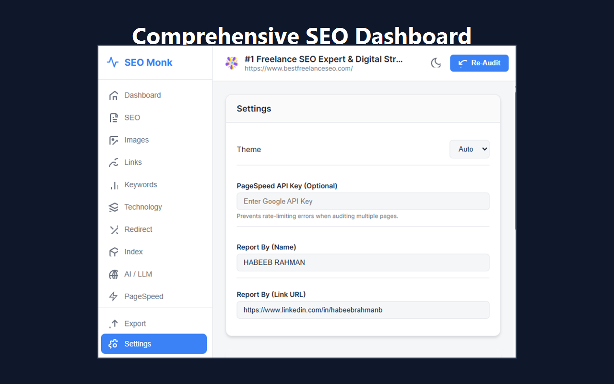
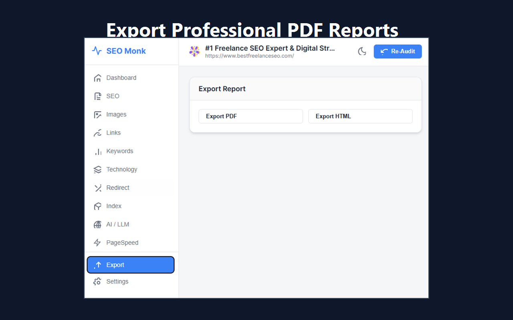

# SEO Monk - Professional SEO Audit Chrome Extension

## Overview
SEO Monk is a premium, lightweight, and professional Chrome Extension built on Manifest V3. It performs a comprehensive, one-click SEO audit directly within your browser, extracting on-page data, evaluating images, links, keywords, and underlying technologies. Now supercharged with Google PageSpeed Insights integration, it provides an unparalleled overview of your website's health without requiring any backend architecture.

## Key Features
- **Modern UI/UX Dashboard**: Built with a sleek, responsive design featuring Dark/Light mode toggle, soft shadows, rounded cards, and smooth CSS animations.
- **Dual-Strategy PageSpeed Insights**: Automatically queries Google's PageSpeed API for both Mobile and Desktop simultaneously. View metrics for Performance, Accessibility, Best Practices, and SEO directly in the extension.
- **Dynamic SEO Scoring**: Proprietary weighted scoring system visualizing your page health on a scale of 0-100, styled with premium color thresholds matching industry standards.
- **Comprehensive On-Page Audits**: Analyzes Meta Tags, Headings, Images, Links, Keywords, Indexability (Robots.txt/Sitemap), and Technologies.
- **Smart Recommendations Engine**: Dynamically identifies critical issues and warnings, offering prioritized, actionable advice to fix them.
- **Professional Exports**: 
  - **Export PDF**: Generates a perfectly styled, standalone PDF report via `html2pdf.js`, saving directly to your computer.
  - **Export HTML**: Clones the exact dashboard UI/UX into a beautiful, shareable, and standalone `.html` file.
- **No Backend Required**: 100% client-side, privacy-first architecture.

## Installation Instructions (Developer Mode)
1. Download or clone this repository to your computer.
2. Open Google Chrome and navigate to `chrome://extensions/`.
3. Enable **Developer mode** using the toggle switch in the top right corner.
4. Click **Load unpacked** and select the `SEO Monk` directory.
5. The extension is now installed! Pin it to your toolbar and click it on any website to run an audit.

## Developer Utilities included
To make publishing to the Chrome Web Store seamless, this repository includes built-in asset generators:
- `generate_icons.html`: Open this file in your browser to instantly generate and save the required 16x16, 32x32, 48x48, and 128x128 pixel PNG icons based on the SEO Monk SVG logo. Save them to the `/icons` folder.
- `generate_store_assets.html`: A custom Chrome Web Store screenshot studio. Open this in your browser, drag and drop your extension UI screenshots into the 3D browser frame, and click save to export stunning, high-resolution (1280x800) promotional images.

## Project Structure
- `manifest.json`: Configuration file for Chrome (Manifest V3).
- `popup.html` / `popup.css` / `popup.js`: The frontend dashboard interface for the extension.
- `background.js`: Service worker handling asynchronous network events (e.g., PageSpeed API calls).
- `content.js`: Injected script that extracts raw DOM data securely.
- `modules/`: 
  - `exportManager.js`: Handles HTML cloning and PDF rendering.
  - Contains separate logical analyzers for SEO, Images, Links, etc.
- `utils/`: Stores external libraries (like `html2pdf.bundle.min.js`) and helper functions.

---

## Developer

**HABEEB RAHMAN**  
[Best Freelance SEO](https://www.bestfreelanceseo.com/?utm_source=google&utm_medium=referral&utm_campaign=chrome)

**Connect with me:**
- [GitHub](https://github.com/habeebrahmanb)
- [LinkedIn](https://www.linkedin.com/in/habeebrahmanb)
- [Facebook](https://www.facebook.com/habeebrahmanb)
- [Instagram](https://www.instagram.com/habeebrahmanb)
